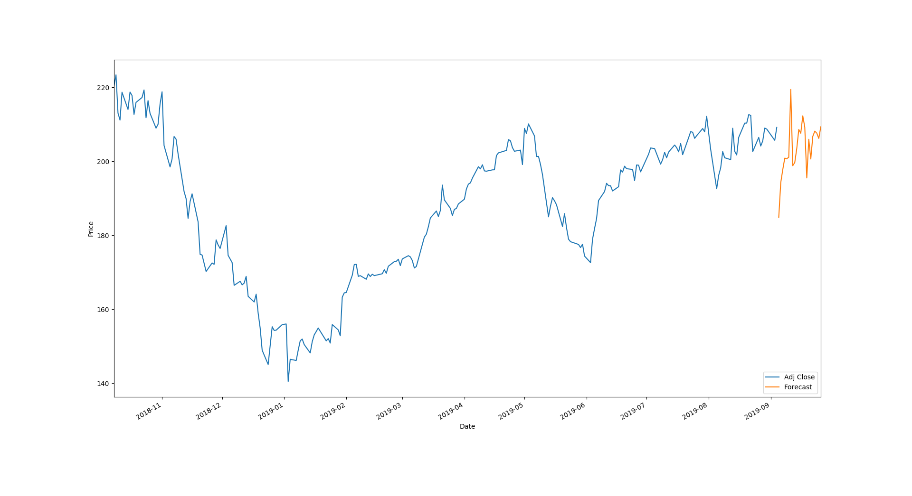

# Stock-Price-Prediction
Stock price prediction using sklearn, it uses pandas web datareader to load the stock data of company from a specified date (see config.py). Then trains 5 models {simple linear regression, polynominal2 regression, polynomial3 regression, knn regression and bayesian regression} to predict the stock price for the next N specified number of days (see config.py).

## Result
Apple stock prediction using the best (**polynomial3 regression** in this case). Orange curve shows the prediction for the next 18 days starting  from 2019-sep-5.


## usage
See config.py, to choose a company **{apple, microsoft, ge, ibm, google}** and choose a date to predict the price and number of days to predict from that date.
```shell
$ python predict.py
```
## Requirements
python3 and see requirements.txt
```shell
pip install -r requirements.txt
```
